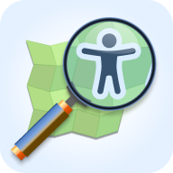

# Planet Accessibility Explorer

**⚠️ This is experimental - Please don't expect anything from this app. It has accessibility issues, and probably still some bugs.**

Visualizes accessibility data from OpenStreetMap.

## Screenshot

## Demo

- [Surfaces in Paris, France](https://sozialhelden.github.io/planet-accessibility-explorer/#/planet-accessibility-explorer/?zoom=13.776755054662608&lat=48.8658708877625&lon=2.3505427262137726)
- [A building entrance in Saarbrücken, Germany](https://sozialhelden.github.io/planet-accessibility-explorer/#/planet-accessibility-explorer/composite/entrances_or_exits:8245385357,entrances_or_exits:8245385357,pedestrian_highways:111486617?lon=6.993899029076753&lat=49.23587964664074&zoom=21.619002812698326)
- [Subway entrances in Karlsruhe, Germany](https://sozialhelden.github.io/planet-accessibility-explorer/#/planet-accessibility-explorer/?zoom=17.8666068729091&lat=49.009011052035035&lon=8.417438232224365)
- [A park building in Potsdam, Germany](https://sozialhelden.github.io/planet-accessibility-explorer/#/planet-accessibility-explorer/composite/amenities:6535421531,buildings:142038726?lon=13.037360633539468&lat=52.40426761401043)
- [A 7-Eleven in Taipei, Taiwan](https://sozialhelden.github.io/planet-accessibility-explorer/#/planet-accessibility-explorer/amenities/4838087720?lon=121.51023309211767&lat=25.05417130989083&zoom=18.277562598242074)

## Features

- Runs in the browser
- Shows features that have accessibility infos from OpenStreetMap:
  - Surface quality and wheelchair accessibility of sidewalks, parks, plazas
  - Building entrances with step height and accessibility descriptions
  - Wheelchair accessibility of buildings (as outlines) and amenity PoIs (as points)
  - Visualizes surfaces around buildings in lower zoom levels and focuses on building accessibility in higher zoom levels
  - Highlighted (in)accessible subway entrances
- Click on features to display a detail view with a summary of accessibility-related OSM tags
- Shows photos from Wikidata

## Caveat

- Not in production yet. Built for our own needs, might not fit your requirements
- Supports only a small subset of what's possible with OpenStreetMap accessibility tags
- No replacement for 'real' accessibility apps like Wheelmap, accessmap.io, …
- No search function

## Development

### Available Scripts

In the project directory, you can run:

#### `npm start`

Runs the app in the development mode.\
Open [http://localhost:3000](http://localhost:3000) to view it in the browser.

The page will reload if you make edits.\
You will also see any lint errors in the console.

#### `npm run test`

Launches the test runner in the interactive watch mode.\
See the section about [running tests](https://facebook.github.io/create-react-app/docs/running-tests) for more information.

#### `npm run build`

Builds the app for production to the `build` folder.\
It correctly bundles React in production mode and optimizes the build for the best performance.

The build is minified and the filenames include the hashes.\
Your app is ready to be deployed!

See the section about [deployment](https://facebook.github.io/create-react-app/docs/deployment) for more information.

### Create React App (CRA)

This project was bootstrapped with [Create React App](https://github.com/facebook/create-react-app).

You can learn more in the [Create React App documentation](https://facebook.github.io/create-react-app/docs/getting-started).

To learn React, check out the [React documentation](https://reactjs.org/).
